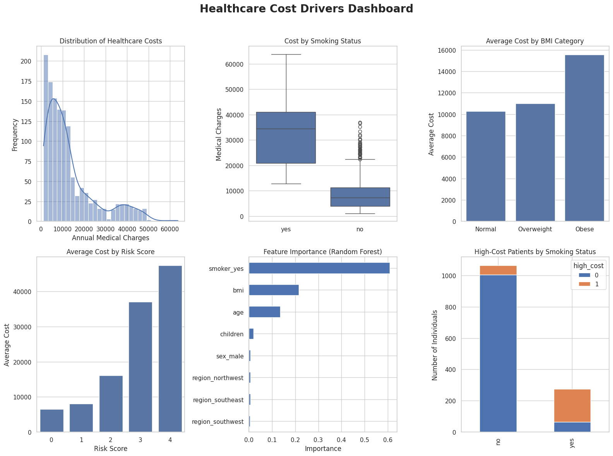

# Preventive Health Analytics: Understanding Healthcare Cost Drivers  
*Using data analytics to identify lifestyle risk factors, predict healthcare costs, and support prevention strategies using causal inference and AI-assisted insights.*

**Dataset:** Health Insurance Dataset (1,338 individuals)  
**Techniques:** SQL analysis, exploratory data analysis (EDA), risk segmentation, K-Means clustering, causal inference (Propensity Score Matching), machine learning (Linear Regression & Random Forest), experimental design concepts (A/B testing), Retrieval-Augmented Generation (RAG).  
**Key Insight:** Smoking increases healthcare costs by approximately **$23,500** per individual per year, making it the strongest cost driver in the dataset.

---
## Business Context

Understanding what drives healthcare spending is essential for insurers, healthcare providers and policymakers. Identifying risk factors early can help design prevention strategies, allocate healthcare resources more efficiently and ultimately improve population health outcomes.

In this context, the analysis focuses on questions such as:

- Which lifestyle factors are associated with higher healthcare costs?
- Are there identifiable **high-risk population segments**?
- How do lifestyle risks interact (for example smoking combined with obesity)?
- Could prevention strategies help reduce long-term healthcare expenses?

---

## Dataset

The analysis uses the **Health Insurance Dataset**, a commonly used dataset for healthcare analytics.

Source:  
https://www.kaggle.com/datasets/mirichoi0218/insurance

Dataset characteristics:

- **1,338 individuals**
- **7 variables**
- fully **anonymized data**
- no missing values

Key variables include:

`age` - age of the insured individual  
`sex` - gender  
`bmi` - body mass index  
`children` - number of dependents  
`smoker` - smoking status  
`region` - geographic region  
`charges` - annual healthcare costs  

Healthcare costs range from roughly **$1,000 to more than $63,000**, indicating the presence of a **high-cost patient segment**.

---

## Objectives

- Identify **key drivers of healthcare costs**
- Perform structured **exploratory data analysis**
- Segment the population into meaningful **risk cohorts**
- Estimate the **causal impact of smoking** on healthcare spending
- Build predictive models to estimate healthcare costs
- Translate analytical results into **business and prevention insights**
- Demonstrate how analytics insights can be extended using **AI-based knowledge retrieval (RAG)**

---

## Analytical Workflow

The project follows a structured analytics workflow similar to what is often used in **analytics teams and consulting environments**.

Main stages:

1. SQL-based exploratory analysis  
2. Exploratory Data Analysis (EDA)  
3. Risk Segmentation analysis  
4. Customer segmentation using clustering  
5. Causal inference analysis  
6. Predictive modeling  
7. Experimental design considerations (A/B testing logic)  
8. AI extension using Retrieval-Augmented Generation (RAG)

---

## How to Explore the Project

The repository contains two notebooks:

- **Preventive_Health_Analytics.ipynb**  
  Full analytical workflow including SQL analysis, exploratory analysis, risk segmentation, clustering, causal inference and predictive modeling.

- **Preventive_Health_Assistant_RAG.ipynb**  
  A simple Retrieval-Augmented Generation prototype that connects the insights from the analytics project with external health knowledge to answer prevention-related questions.

Both notebooks are designed to be read sequentially, starting with the analytical project and then exploring the RAG prototype.
 
---

## SQL-Based Analysis: Risk Segmentation

The analysis begins with **SQL queries** to explore the dataset. To better understand risk patterns, individuals were grouped into **risk segmentation** based on lifestyle factors.

Key questions investigated:

- How do healthcare costs differ between **smokers and non-smokers**?
- How do costs evolve across **age groups**?
- What is the relationship between **BMI and medical spending**?
- Do lifestyle risks interact (for example **smoking combined with obesity**)?

The SQL exploration revealed that individuals combining **smoking and obesity** represent the highest-risk segmentation and generate dramatically higher healthcare expenses compared to other groups.

Also revealed that smokers incur **nearly four times higher medical costs on average** compared to non-smokers.


---
## Exploratory Data Analysis

The exploratory analysis revealed a **highly skewed distribution of healthcare costs**, where most individuals generate moderate expenses while a smaller group incurs very high medical costs.

This pattern is common in healthcare systems and suggests that **a small number of high-risk individuals may drive a large share of total healthcare spending**.

These observations motivated the following analyses, including clustering and causal inference, to better understand which factors contribute most to high medical expenses.

---

## Customer Segmentation (K-Means Clustering)

Unsupervised learning was applied using **K-Means clustering** to identify natural population segments.

Four clusters emerged:

- **Young & Healthy segment** with relatively low medical costs  
- **Family segment** with moderate expenses  
- **Older population segment** with gradually increasing costs  
- **High-risk lifestyle segment** with dramatically higher healthcare spending  

Clustering helps organizations identify **population groups with different healthcare needs**, enabling more targeted prevention programs.

---

## Causal Inference: Smoking Impact

To estimate the causal effect of smoking, **Propensity Score Matching (PSM)** was applied.

This method compares smokers with non-smokers who have similar characteristics, helping isolate the impact of smoking on healthcare spending.

The results suggest that smoking increases annual healthcare costs by approximately **$23,500 per individual**.

This reinforces smoking as the **largest cost driver in the dataset**.

---

## Predictive Modeling

Two models were trained to estimate healthcare costs:

- **Linear Regression**
- **Random Forest Regressor**

Performance results:

- Linear Regression R² ≈ **0.78**
- Random Forest R² ≈ **0.86**

The Random Forest model captures non-linear relationships between variables and improves predictive performance.

Feature importance analysis highlights three main drivers:

- **Smoking status**
- **BMI**
- **Age**

---

## Healthcare Cost Drivers Dashboard



**Figure:** Summary dashboard combining distribution analysis, smoking impact, BMI effects, risk score patterns and feature importance from the predictive model.

This visualization summarizes the **main cost drivers identified throughout the analysis**.

---

## Experimental Design Perspective (A/B Testing Logic)

From a strategic perspective, the analysis suggests that **prevention programs could significantly reduce healthcare spending**.

For example, a smoking cessation initiative could be evaluated using an **A/B testing framework**:

- Treatment group: individuals participating in a smoking cessation program  
- Control group: individuals not participating  

Tracking healthcare costs over time would allow organizations to measure the **causal impact of prevention programs**.

---

## AI Extension: Preventive Health Assistant (RAG)

The repository also includes a second notebook demonstrating a simple **Retrieval-Augmented Generation (RAG)** prototype.

The assistant combines:

- insights from the analytics project  
- external health knowledge related to lifestyle risks  

This prototype illustrates how analytics and AI can work together to create **decision-support tools focused on prevention and health education**.

---

## Key Insights

Several consistent insights emerge across the analysis:

- **Smoking is the strongest cost driver**  
- **Risk factors accumulate**, increasing healthcare spending significantly  
- **High-risk cohorts represent a small portion of the population but generate a large share of healthcare costs**  
- **Preventive interventions could significantly reduce long-term healthcare expenses**

---

## Business Impact

These findings suggest several potential applications:

**Prevention programs**: Targeted smoking cessation initiatives could reduce healthcare spending significantly.

**Population health management**: Risk cohort segmentation allows healthcare organizations to focus resources on high-risk groups.

**Cost forecasting**: Predictive models can support planning and healthcare cost estimation.

**Strategic healthcare planning**: Understanding cost drivers supports more sustainable healthcare strategies.

---

## Limitations

Some limitations should be considered:

- relatively **small dataset**
- limited number of health-related variables
- lack of longitudinal patient data

Despite these limitations, the project demonstrates how analytics can reveal meaningful patterns in healthcare spending.

---

## Next Steps

Possible future extensions include:

- incorporating additional healthcare datasets  
- evaluating alternative machine learning models  
- developing automated SQL pipelines  
- building interactive dashboards  
- testing real-world prevention programs  

---

## Repository Structure

```
.
├── data
│   └── insurance.csv
├── notebooks
│   ├── Preventive_Health_Analytics.ipynb
│   └── Preventive_Health_Assistant_RAG.ipynb
├── images
│   └── Healthcare_Cost_Dashboard.png
├── requirements.txt
└── README.md
```

---

## Conclusion

This project demonstrates how data analytics can be used to identify **key healthcare cost drivers and risk patterns**.

By combining SQL analysis, segmentation techniques, causal inference and machine learning, the analysis provides insights that can support **prevention-oriented healthcare strategies**.

The addition of a RAG-based assistant illustrates how analytics insights can be connected with external knowledge, opening possibilities for **AI-supported healthcare decision tools**.
